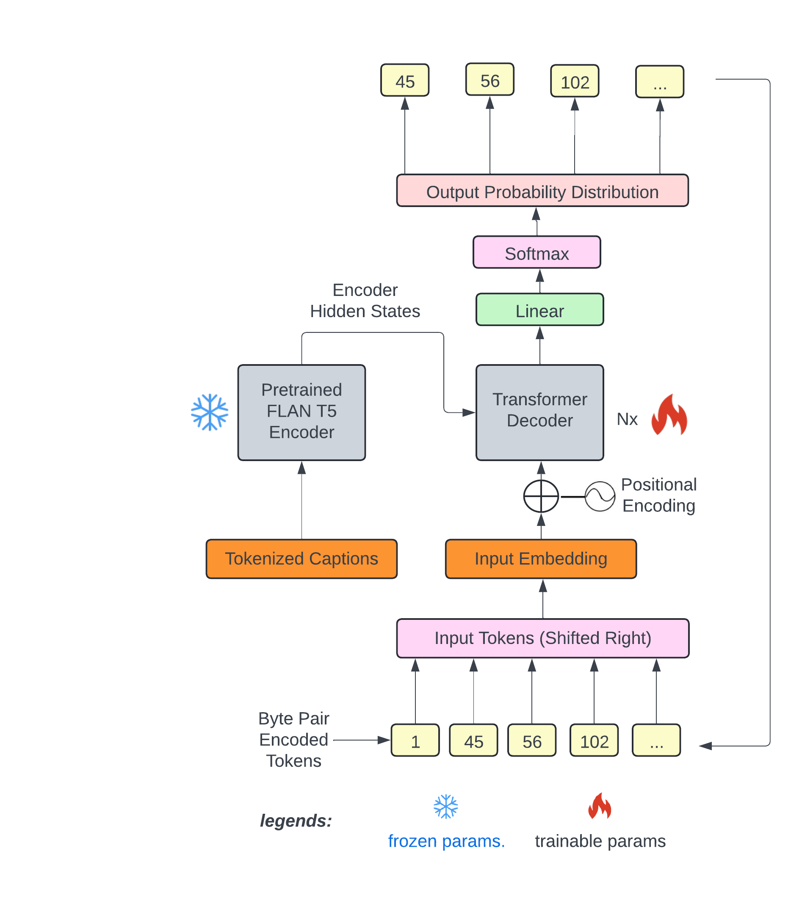

# Text2midi: Generating Symbolic Music from Captions

[Demo](https://huggingface.co/spaces/amaai-lab/text2midi) | [Model](https://huggingface.co/amaai-lab/text2midi) | [Examples](https://amaai-lab.github.io/Text2midi/) | [Paper](https://arxiv.org/abs/2412.16526) | [Dataset](https://huggingface.co/datasets/amaai-lab/MidiCaps)

[](https://huggingface.co/spaces/amaai-lab/text2midi)
</div>

**text2midi** is the first end-to-end model for generating MIDI files from textual descriptions. By leveraging pretrained large language models and a powerful autoregressive transformer decoder, **text2midi** allows users to create symbolic music that aligns with detailed textual prompts, including musical attributes like chords, tempo, and style. The details of the model are described in [this paper](https://arxiv.org/abs/2412.16526). 

🔥 Live demo available on [HuggingFace Spaces](https://huggingface.co/spaces/amaai-lab/text2midi).

🔥 Update: Text2midi has been accepted at AAAI! 

<div align="center">
  
</div>

## Quickstart Guide

Generate symbolic music from a text prompt:

```python
import pickle
import torch
import torch.nn as nn
from transformers import T5Tokenizer
from model.transformer_model import Transformer
from huggingface_hub import hf_hub_download

repo_id = "amaai-lab/text2midi"
# Download the model.bin file
model_path = hf_hub_download(repo_id=repo_id, filename="pytorch_model.bin")
# Download the vocab_remi.pkl file
tokenizer_path = hf_hub_download(repo_id=repo_id, filename="vocab_remi.pkl")

if torch.cuda.is_available():
    device = 'cuda'
elif torch.backends.mps.is_available():
    device = 'mps'
else:
    device = 'cpu'

print(f"Using device: {device}")

# Load the tokenizer dictionary
with open(tokenizer_path, "rb") as f:
    r_tokenizer = pickle.load(f)

# Get the vocab size
vocab_size = len(r_tokenizer)
print("Vocab size: ", vocab_size)
model = Transformer(vocab_size, 768, 8, 2048, 18, 1024, False, 8, device=device)
model.load_state_dict(torch.load(model_path, map_location=device))
model.eval()
tokenizer = T5Tokenizer.from_pretrained("google/flan-t5-base")

print('Model loaded.')


# Enter the text prompt and tokenize it
src = "A melodic electronic song with ambient elements, featuring piano, acoustic guitar, alto saxophone, string ensemble, and electric bass. Set in G minor with a 4/4 time signature, it moves at a lively Presto tempo. The composition evokes a blend of relaxation and darkness, with hints of happiness and a meditative quality."
print('Generating for prompt: ' + src)

inputs = tokenizer(src, return_tensors='pt', padding=True, truncation=True)
input_ids = nn.utils.rnn.pad_sequence(inputs.input_ids, batch_first=True, padding_value=0)
input_ids = input_ids.to(device)
attention_mask =nn.utils.rnn.pad_sequence(inputs.attention_mask, batch_first=True, padding_value=0) 
attention_mask = attention_mask.to(device)

# Generate the midi
output = model.generate(input_ids, attention_mask, max_len=2000,temperature = 1.0)
output_list = output[0].tolist()
generated_midi = r_tokenizer.decode(output_list)
generated_midi.dump_midi("output.mid")
```

## Installation

If you have CUDA supported machine:
```bash
git clone https://github.com/AMAAI-Lab/text2midi
cd text2midi
pip install -r requirements.txt
```
Alternatively, if you have MPS supported machine:
```bash
git clone https://github.com/AMAAI-Lab/text2midi
cd text2midi
pip install -r requirements-mac.txt
```

## Datasets

The model was trained using two datasets: [SymphonyNet](https://symphonynet.github.io/) for semi-supervised pretraining and MidiCaps for finetuning towards MIDI generation from captions. 
The [MidiCaps dataset](https://huggingface.co/datasets/amaai-lab/MidiCaps) is a large-scale dataset of 168k MIDI files paired with rich text captions. These captions contain musical attributes such as key, tempo, style, and mood, making it ideal for text-to-MIDI generation tasks as described in [this paper](https://arxiv.org/abs/2406.02255). 


## Citation
If you use text2midi in your research, please cite:
```
@inproceedings{bhandari2025text2midi,
    title={text2midi: Generating Symbolic Music from Captions}, 
    author={Keshav Bhandari and Abhinaba Roy and Kyra Wang and Geeta Puri and Simon Colton and Dorien Herremans},
    booktitle={Proceedings of the 39th AAAI Conference on Artificial Intelligence (AAAI 2025)},
    year={2025}
}
```

## Results of the Listening Study

Each question is rated on a Likert scale from 1 (very bad) to 7 (very good). The table shows the average ratings per question for each group of participants.

| Question            | MidiCaps | text2midi | MuseCoco |
|---------------------|----------|-----------|----------|
| Musical Quality     | 5.79     | 4.62      | 4.40     |
| Overall Matching    | 5.42     | 4.67      | 4.07     |
| Genre Matching      | 5.54     | 4.98      | 4.40     |
| Mood Matching       | 5.70     | 5.00      | 4.32     |
| Key Matching        | 4.61     | 3.64      | 3.36     |
| Chord Matching      | 3.20     | 2.50      | 2.00     |
| Tempo Matching      | 5.89     | 5.42      | 4.94     |


## Objective Evaluations
Results of objective evaluation for *all* of MidiCaps test set. Please not we have improved from all the numbers written in the paper (the numbers in paper are on a small subset of MidiCaps test set). 

| Metric              | text2midi | MidiCaps | MuseCoco |
|---------------------|-----------|----------|----------|
| CR ↑               | 2.31      | 3.43     | 2.12     |
| CLAP ↑             | 0.22      | 0.26     | 0.21     |
| TB (%) ↑           | 39.70     | -        | 21.71    |
| TBT (%) ↑          | 65.80     | -        | 54.63    |
| CK (%) ↑           | 33.60     | -        | 13.70    |
| CKD (%) ↑          | 35.60     | -        | 14.59    |

**Note**:  
CR = Compression ratio  
CLAP = CLAP score  
TB = Tempo Bin  
TBT = Tempo Bin with Tolerance  
CK = Correct Key  
CKD = Correct Key with Duplicates  
↑ = Higher score is better.

## Training
To train text2midi, we recommend using accelerate for multi-GPU support. First, configure accelerate by running:
```bash
accelerate config
```

Then, use the following command to start training:
```bash
accelerate launch --multi_gpu --num_processes=4 train_accelerate.py --config ../config.yaml
```

## Inference
We support inference on CUDA, MPS and cpu. Please make sure you have pip installed the correct requirement file (requirments.txt for CUDA, requirements-mac.txt for MPS)
```bash
python model/transformer_model.py --caption <your intended descriptions>
```


